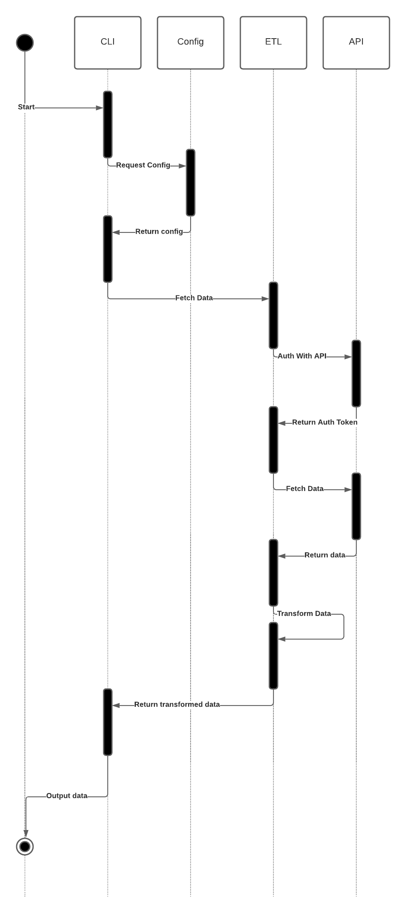

# Notes/Thoughts while working

- Auth credentails should live in a config file
- The task itself is an ETL problem
- Not written any php since 5.6, let's see how 8.0 is
- The assignment itself says not to use any libraries, so lets forget about composer
- No UI is required, so lets make this a CLI

## High Level Design

## Further improvements

Keeping to thr 4-5 hours suggested time, further improvements can be made:

- Unit tests!
- The current solution calls the API directly and then processes the data. As a future solution we could implement some caching, even if that means writing the data to a file
